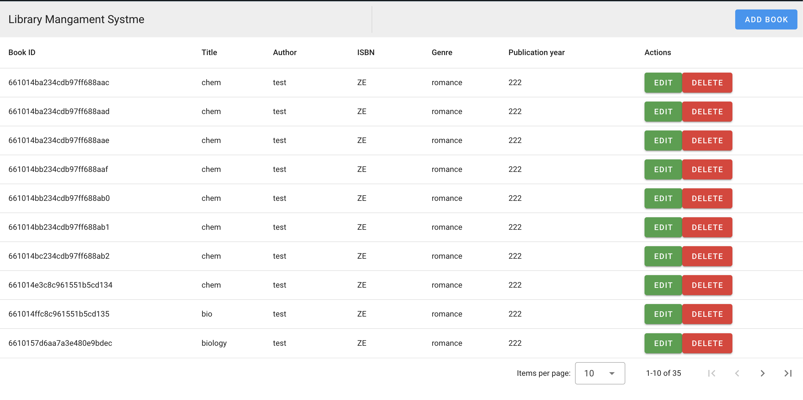

# library-management-system

This is a simple full-stack project for a library managment system

## Technologies
- Flask restful: for the back-end API
- Vue3 : for front-end 
- mongodb: for database

## API endpoints
### Adding new book endpoint
POST http://127.0.0.1:5000/books/
{
  "author": srt,
  "ISBN": int,
  "genre": str,
  "title": "str,
  "pub_year": int,
}

### Updadintng existing book
PUT http://127.0.0.1:5000/books/id
{
  "author": srt,
  "ISBN": int,
  "genre": str,
  "title": "str,
  "pub_year": int,
}

### Getting book by id
GET http://127.0.0.1:5000/books/id

### Getting all books
GET http://127.0.0.1:5000/books/

### Delete a book by id
DELETE http://127.0.0.1:5000/books/id

## Vuetify UI
I used some UI components from Vuetify library as the buttons, data table and cards

## Vedio demo

